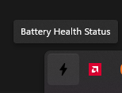
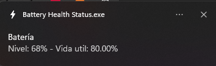

 Battery Health Status 

Este programa fue creado con el fin de poder ver y entender de manera mas certera la informacion de tu bateria, ya que muchas veces nos preguntamos cual sera la condicion de mi bateria ya que pensamos que dura muy poco a veces y no entendemos porque.
Este programa se encuentra en su version 1.0 por lo que es normal que exitan bugs o fallos, se esta trabajando para poder afinarlo lo mejor que se pueda y traer mas mejoras que ayuden con el rendimiento de la bateria o muestren mas informacion relacionada con la bateria.

## Descripción

Este programa crea un icono en la barra de tareas que, al ser pulsado, muestra una notificación con información sobre el estado de la batería, incluyendo el nivel de carga y la vida útil estimada de la batería.

## Funcionalidades

- Genera un informe de batería en formato HTML.
- Muestra notificaciones con información sobre el nivel de carga y la vida útil de la batería.
- Utiliza un icono personalizado en la barra de tareas.

## Capturas de Pantalla

- **Icono en la Barra de Tareas:**
  

    
  

- **Notificación de Batería:**
  

    
  

## Instrucciones

1. **Descargar Programa:**
   - Descarga el archivo .exe para la instalacion del programa.

2. **Ejecutar el Script:**
   - Si es posible ejecuta el script como administrador para obtener información sobre la batería y recibir notificaciones de manera correcta, de lo contrario el programa se instalara pero podra darte algunos errores.

## Descargar

Puedes descargar la versión ejecutable del programa [aquí](https://cdn.discordapp.com/attachments/1014777564239245334/1175892444118794251/BatteryHealthStatus.exe?ex=656ce22d&is=655a6d2d&hm=6a0ac89e39c3c35bc03dd0d2a9c38a95be6adc8583c41fbf264a7f35001194cf&).
Solo sigue las instrucciones del instalador y no deberias tener ningun problema

**Nota:** Asegúrate de ejecutar el programa con permisos de administrador para acceder a la información de la batería.

